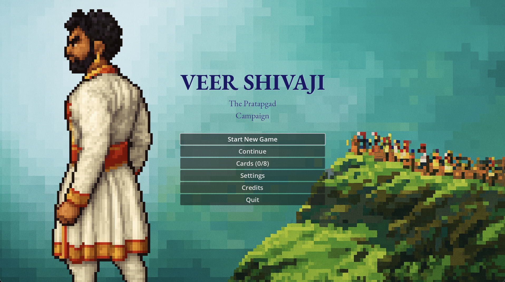

# Veer Shivaji: Pratapgad Campaign

**A 2D historical adventure game celebrating the legendary encounter between Chhatrapati Shivaji Maharaj and Afzal Khan at Pratapgad fort in 1659.**

Built with Godot 4.x | Platforms: MacOS, iPad

---

## 🏛️ About the Story

Experience one of the most pivotal moments in Maratha history through an engaging platformer that combines strategic storytelling with educational content. Guide Shivaji through intelligence gathering, diplomatic maneuvering, and the climactic confrontation that would change the course of the Deccan.

## 🎮 Game Features

- **🏃‍♂️ 2D Platformer Gameplay**: Mario-style jumping and exploration
- **📚 Educational Content**: Unlock historical Shivkaari cards with authentic information
- **💬 Rich Storytelling**: Multiple characters with historically-inspired dialogues
- **🎯 Strategic Objectives**: Complete missions that reflect Shivaji's tactical brilliance
- **💾 Save System**: Resume your campaign exactly where you left off

## 🎯 Current Status

**✅ Level 1 Complete**: "The Shadow of Afzal Khan"

- Fully playable with 3 NPCs and story progression
- Complete save/continue functionality
- Educational card reward system

## 🚀 Quick Start

1. **Requirements**: Godot 4.x
2. **Clone** this repository
3. **Open** `veer-shivaji` folder in Godot
4. **Run** the project and select Level 1 from the main menu

### Controls

- **A/D or Arrow Keys**: Move left/right
- **Space/W**: Jump
- **E**: Interact with NPCs / Start dialogue
- **Space**: Advance dialogue
- **ESC**: Return to menu

## 🎨 Development

This project emphasizes:

- **Historical Accuracy**: Respectful portrayal of Marathi heritage
- **Educational Value**: Learning through interactive storytelling
- **Cultural Sensitivity**: Authentic representation of characters and events

## 📖 Story Chapters (Planned)

1. **The Shadow of Afzal Khan** ✅ - Intelligence gathering
2. **Preparing for War** 🔄 - Resource management and strategy
3. **The Javali Valley** 🔄 - Terrain advantage selection
4. **Deceptive Invitation** 🔄 - Diplomatic maneuvering
5. **The Trap is Set** 🔄 - Final preparations
6. **The Meeting** 🔄 - The legendary encounter
7. **Battle at Pratapgad** 🔄 - Strategic combat
8. **Aftermath** 🔄 - Consequences and victory
9. **Epilogue** 🔄 - Historical impact

## 🏆 Educational Goals

- Understanding strategic thinking and intelligence gathering
- Appreciating the importance of cultural heritage
- Learning about 17th-century Maratha history
- Developing problem-solving through historical scenarios

## 🔧 Technical Stack

- **Engine**: Godot 4.x (GDScript)
- **Art Style**: Pixel art (ready for implementation)
- **Audio**: Framework implemented, assets pending
- **Platforms**: Cross-platform (MacOS primary, iPad ready)

---

## 📜 Historical Note

This game is created with deep respect for Chhatrapati Shivaji Maharaj and the rich heritage of the Maratha empire. All story elements are inspired by historical accounts while being adapted for interactive entertainment and education.

**Har Har Mahadev!** 🚩

---

*Developed as an educational tribute to Marathi history and the enduring legacy of Chhatrapati Shivaji Maharaj.*
